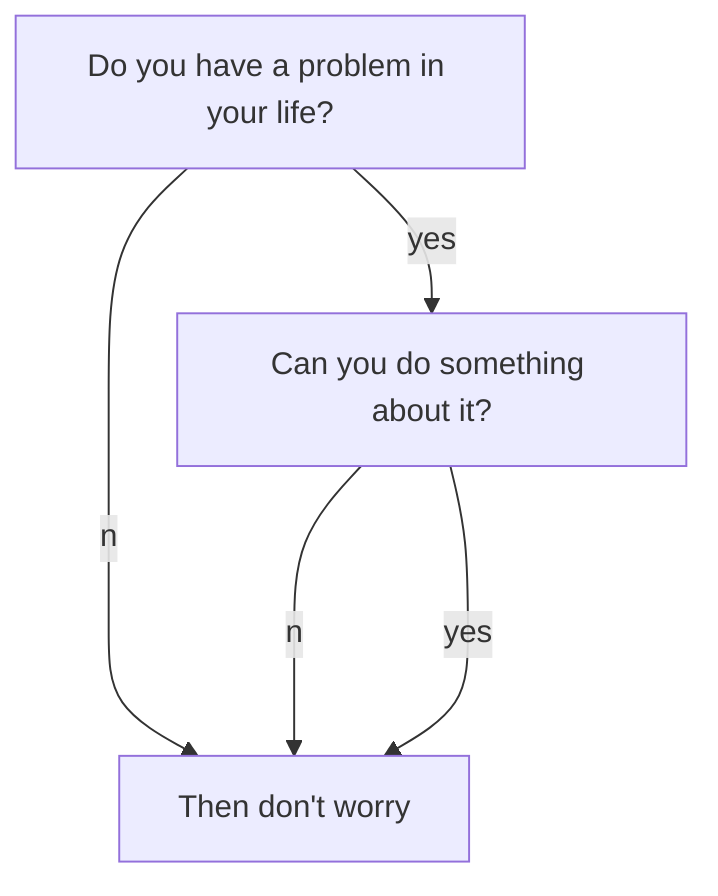

- 这里是一个目录
{:toc}

<div></div>

<div></div>

<div></div>

<div></div>



```chart
{
  "type": "polarArea",
  "data": {
    "datasets": [
      {
        "data": [
          11,
          16,
          7,
          3,
          14
        ],
        "backgroundColor": [
          "#FF6384",
          "#4BC0C0",
          "#FFCE56",
          "#E7E9ED",
          "#36A2EB"
        ],
        "label": "My dataset"
      }
    ],
    "labels": [
      "Red",
      "Green",
      "Yellow",
      "Grey",
      "Blue"
    ]
  },
  "options": {}
}
```

# first
bala ....
## second
bala...
### third
bala...
### forth
baaa..
### sixth
#### another
aaa

para A
========
para B

<!-- more -->

    a <- c(1:100) #宇宙最高司令教导我们说可以把一行代码写的尽量长长长长长长长长长长长长长长长长长长长长长长长长长长长长长长长长长长长长长长长长长长长长长一些
    b <- c(2:101)
    cccccccccccccccccccccccccccc
    ytufkyuffyfufufuyfuyf
    jigiugigys
^
    c <- b-a

* kram
+ down
- now

1. kram
2. down
3. now

kramdown
: A Markdown-superset converter

Maruku
:     Another Markdown-superset converter

|-----------------+------------+-----------------+----------------|
| Default aligned |Left aligned| Center aligned  | Right aligned  |
|-----------------|:-----------|:---------------:|---------------:|
| First body part |Second cell | Third cell      | fourth cell    |
| Second line     |foo         | **strong**      | baz            |
| Third line      |quux        | baz             | bar            |
|-----------------+------------+-----------------+----------------|
| Second body     |            |                 |                |
| 2 line          |            |                 |                |
|=================+============+=================+================|
| Footer row      |            |                 |                |
|-----------------+------------+-----------------+----------------|

this is a warning!   
{:.warning}

That's some text with a footnote.[^1]

[^1]: And that's the footnote.

That's the second paragraph.

$$
\begin{align*}
  & \phi(x,y) = \phi \left(\sum_{i=1}^n x_ie_i, \sum_{j=1}^n y_je_j \right)
  = \sum_{i=1}^n \sum_{j=1}^n x_i y_j \phi(e_i, e_j) = \\
  & (x_1, \ldots, x_n) \left( \begin{array}{ccc}
      \phi(e_1, e_1) & \cdots & \phi(e_1, e_n) \\
      \vdots & \ddots & \vdots \\
      \phi(e_n, e_1) & \cdots & \phi(e_n, e_n)
    \end{array} \right)
  \left( \begin{array}{c}
      y_1 \\
      \vdots \\
      y_n
    \end{array} \right)
\end{align*}
$$

~~~python
###title
def main():
    print("123")
~~~